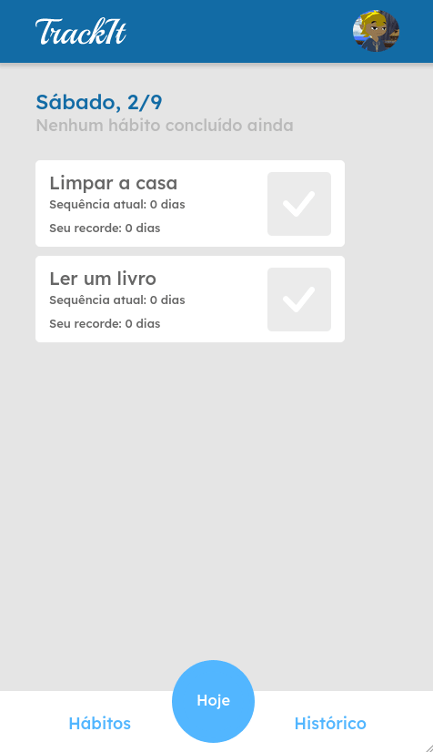
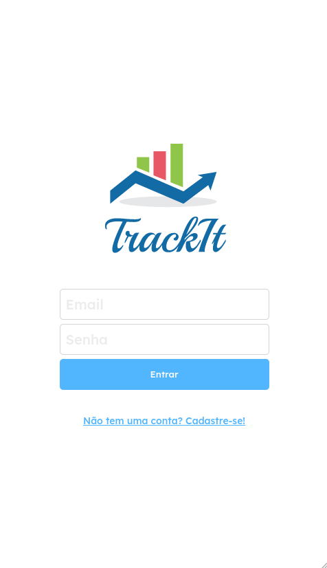
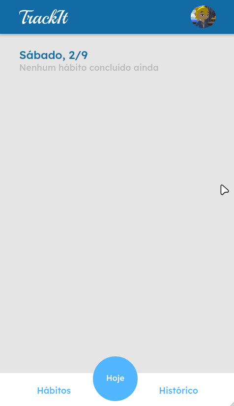
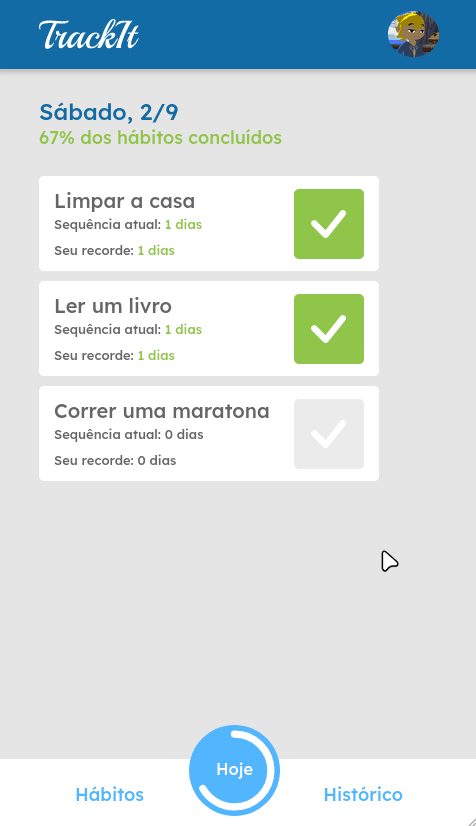

# Track It

An easy-to-use habit manager. Keep track of your habits, mark them as done, create new ones or delete them if you like!





**Try it out now at https://projeto11-trackit-gpsign.vercel.app/**

## About

This is an web application that can make easier for the user to manage their habits. Below are the implemented features:

### Sign Up



<br> **Create you own account!**

### Login


<br> **Login with the account you just created!**


### Create a habit



<br> **Name a habit, select the desired days of the week and click the button! Simple as that!**


### Delete a habit




<br> **Don't need to track a habit anymore? Just delete it!**

## Technologies
The following tools and frameworks were used in the construction of the project:<br>
<p>
  
  
  
  
  
</p>
  

## How to run

1. Clone this repository
2. Install dependencies
```bash
npm i
```
3. Run the front-end with
```bash
npm run dev
```
4. Finally access http://localhost:5173 on your browser!